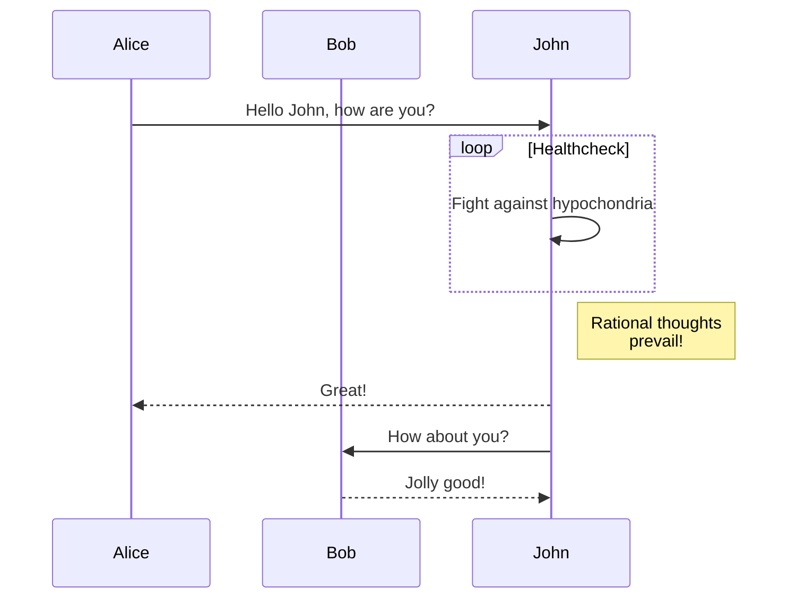

## Not working

Examples of Mermaid diagrams that don't work for some reason.

This could be because the above diagram is too long -- this is a known issue with using the current workaround

## Pie charts

The simple diagram on the [[pie chart]] page also does not appear to be rendering correctly. Cause currently undetermined, but this may be another limitation of the mermaid.ink service.
